# StreamingApp DevOps Project Documentation

## Project Overview

This project demonstrates the deployment of a MERN-based microservices streaming application using modern DevOps practices and AWS cloud services.

The project includes:

- Docker containerization
- Jenkins CI/CD pipeline
- AWS ECR image management
- Kubernetes deployment on Amazon EKS
- Helm chart deployment
- Horizontal Pod Autoscaling (HPA)
- AWS CloudWatch monitoring
- AWS SNS alerts integration
- GitHub webhook automation

The entire infrastructure and deployment workflow was implemented and validated successfully.

---

# Table of Contents

1. Architecture Overview
2. Technology Stack
3. Project Structure
4. AWS Infrastructure Setup
5. Jenkins Setup
6. Dockerization
7. Amazon ECR Setup
8. Kubernetes Deployment using EKS
9. Helm Charts
10. Horizontal Pod Autoscaling
11. CloudWatch Monitoring
12. SNS Alerts Integration
13. GitHub Webhook Automation
14. CI/CD Pipeline Workflow
15. Application Validation
16. Challenges Faced and Solutions
17. Future Improvements
18. Conclusion

---

# 1. Architecture Overview

The application consists of multiple microservices deployed on Amazon EKS.

Architecture Flow:

GitHub Repository
→ GitHub Webhook
→ Jenkins Pipeline
→ Docker Build
→ Amazon ECR Push
→ Helm Upgrade
→ Amazon EKS Deployment
→ CloudWatch Monitoring
→ SNS Email Alerts

Microservices:

- Frontend Service
- Auth Service
- Streaming Service
- Admin Service
- Chat Service
- MongoDB Database

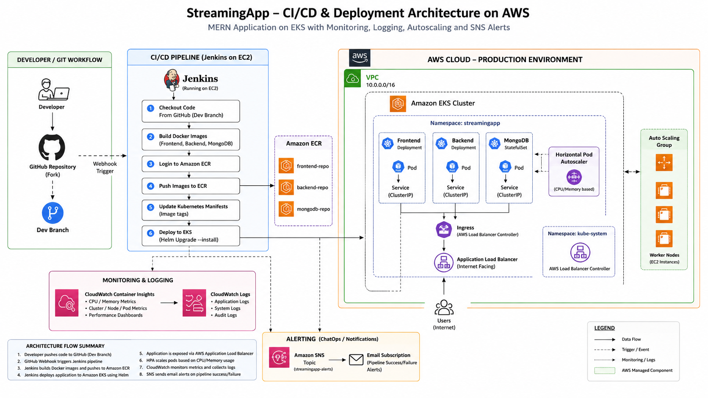

---

# 2. Technology Stack

## Frontend

- React.js

## Backend

- Node.js
- Express.js
- MongoDB

## DevOps Tools

- Docker
- Docker Compose
- Jenkins
- Kubernetes
- Helm
- GitHub Webhooks

## AWS Services

- Amazon EC2
- Amazon ECR
- Amazon EKS
- Amazon CloudWatch
- Amazon SNS

---

# 3. Project Structure

```bash
StreamingApp/
├── backend/
│   ├── adminService/
│   ├── authService/
│   ├── chatService/
│   └── streamingService/
├── frontend/
├── helm/
│   └── streamingapp-chart/
├── k8s/
├── screenshots/
├── docker-compose.yml
├── Jenkinsfile
└── README.md
```

---

# 4. AWS Infrastructure Setup

## EC2 Instance Creation

Ubuntu 24.04 LTS EC2 instance was created.

Instance Type:

```bash
t3.medium
```

Security Group Ports Opened:

```bash
22   - SSH
80   - HTTP
3000 - Frontend
8080 - Jenkins
```

## Installed Tools

```bash
Docker
Kubectl
AWS CLI
Helm
Eksctl
Java 21
Jenkins
```

## Verification Commands

```bash
docker --version
aws --version
kubectl version --client
helm version
eksctl version
```

---

# 5. Jenkins Setup

## Install Java 21

```bash
sudo apt install openjdk-21-jdk -y
```

## Verify Java

```bash
java -version
```

## Download Jenkins

```bash
wget https://get.jenkins.io/war-stable/latest/jenkins.war
```

## Run Jenkins

```bash
java -jar jenkins.war --httpPort=8080
```

## Access Jenkins

```bash
http://<EC2-PUBLIC-IP>:8080
```

## Installed Jenkins Plugins

- Docker Pipeline
- Kubernetes
- Pipeline
- GitHub Integration
- AWS Credentials

---

# 6. Dockerization

## Docker Compose Setup

The application contains multiple services:

- MongoDB
- Auth Service
- Streaming Service
- Admin Service
- Chat Service
- Frontend

## Build and Run Containers

```bash
docker compose up -d --build
```

## Verify Containers

```bash
docker ps
```

## Screenshots

Docker containers running:


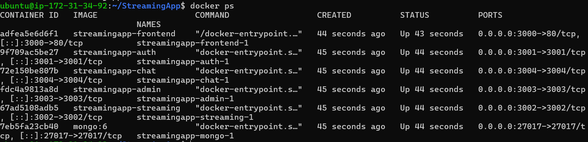


---

# 7. Amazon ECR Setup

## Authenticate Docker with ECR

```bash
aws ecr get-login-password --region ap-south-1 | docker login --username AWS --password-stdin <ACCOUNT_ID>.dkr.ecr.ap-south-1.amazonaws.com
```

## Create ECR Repositories

Repositories created:

- streamingapp-frontend
- streamingapp-auth
- streamingapp-streaming
- streamingapp-admin
- streamingapp-chat

## Push Docker Images

```bash
docker push <ECR_IMAGE_URI>
```

## Verify AWS Identity

```bash
aws sts get-caller-identity
```

## Screenshots

ECR repositories:


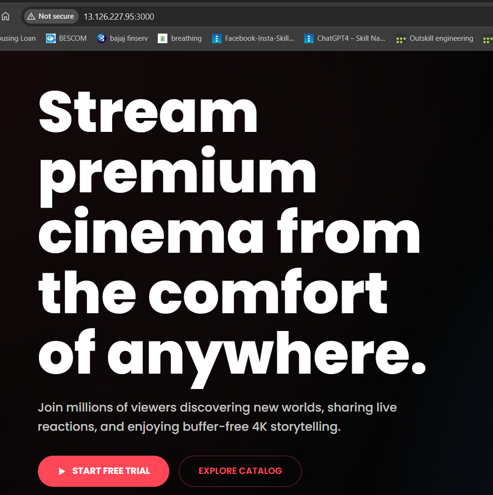


---

# 8. Kubernetes Deployment using EKS

## Create EKS Cluster

```bash
eksctl create cluster \
--name streamingapp-cluster \
--region ap-south-1 \
--nodegroup-name workers \
--node-type t3.medium \
--nodes 2
```

## Verify Cluster

```bash
kubectl get nodes
```

## Deploy Kubernetes Resources

```bash
kubectl apply -f k8s/
```

## Verify Pods

```bash
kubectl get pods -n streamingapp
```

## Verify Services

```bash
kubectl get svc -n streamingapp
```

## Frontend Access

Frontend was exposed using LoadBalancer service.

## Screenshots

Kubernetes Pods:


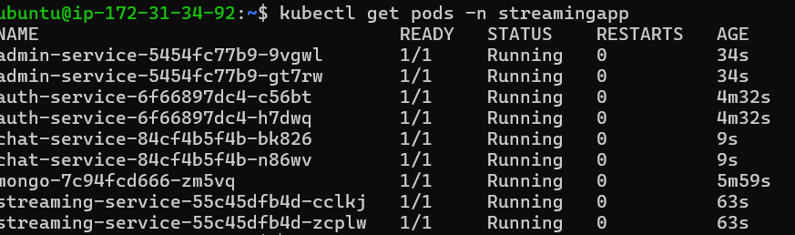


Kubernetes Services:


Frontend Application:


---

# 9. Helm Charts

## Create Helm Chart

```bash
helm create streamingapp-chart
```

## Deploy using Helm

```bash
helm install streamingapp streamingapp-chart -n streamingapp
```

## Upgrade Helm Release

```bash
helm upgrade streamingapp streamingapp-chart -n streamingapp
```

## Verify Helm Release

```bash
helm list -n streamingapp
```


---

# 10. Horizontal Pod Autoscaling

## Install Metrics Server

```bash
kubectl apply -f https://github.com/kubernetes-sigs/metrics-server/releases/latest/download/components.yaml
```

## Verify Metrics

```bash
kubectl top nodes
kubectl top pods -n streamingapp
```

## Create HPA

```bash
kubectl autoscale deployment auth-service \
--cpu-percent=70 \
--min=2 \
--max=5 \
-n streamingapp
```

## Verify HPA

```bash
kubectl get hpa -n streamingapp
```

## Screenshots

HPA Metrics:


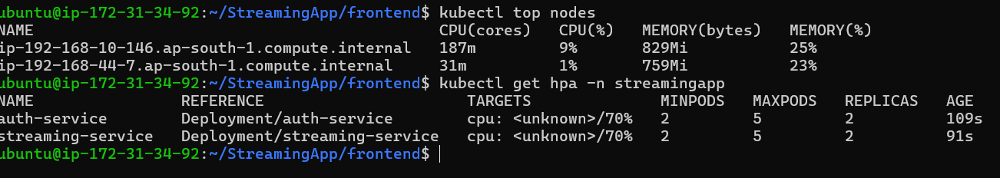


---

# 11. CloudWatch Monitoring

## Install CloudWatch Agent

```bash
curl https://raw.githubusercontent.com/aws-samples/amazon-cloudwatch-container-insights/latest/k8s-deployment-manifest-templates/deployment-mode/daemonset/container-insights-monitoring/quickstart/cwagent-fluent-bit-quickstart.yaml | sed "s/{{cluster_name}}/streamingapp-cluster/;s/{{region_name}}/ap-south-1/" | kubectl apply -f -
```

## Attach IAM Policy

```bash
aws iam attach-role-policy \
--role-name eksctl-streamingapp-cluster-nodegr-NodeInstanceRole-BhB1uEcCyMju \
--policy-arn arn:aws:iam::aws:policy/CloudWatchAgentServerPolicy
```

## Restart CloudWatch Agent

```bash
kubectl rollout restart daemonset cloudwatch-agent -n amazon-cloudwatch
```

## Verify Monitoring

CloudWatch Container Insights displayed:

- Cluster CPU Utilization
- Cluster Memory Utilization
- Node Metrics
- Resource Graphs

## Screenshots

CloudWatch Dashboard:

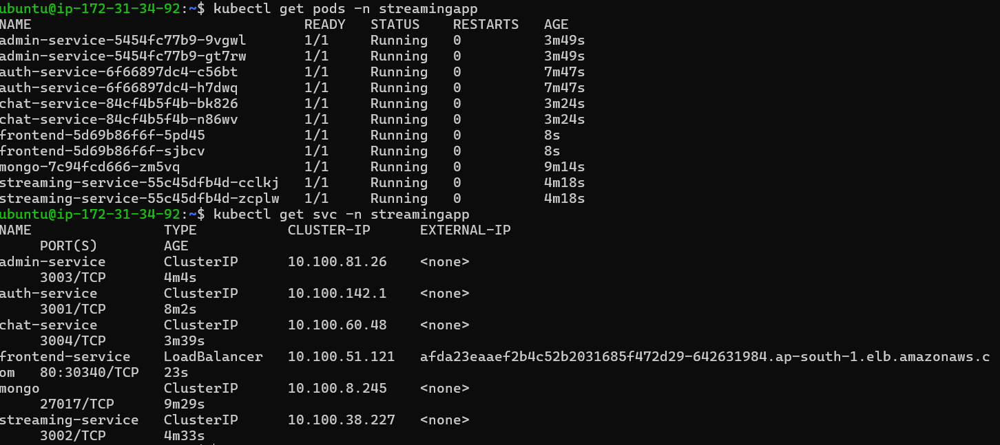


Cluster Metrics:


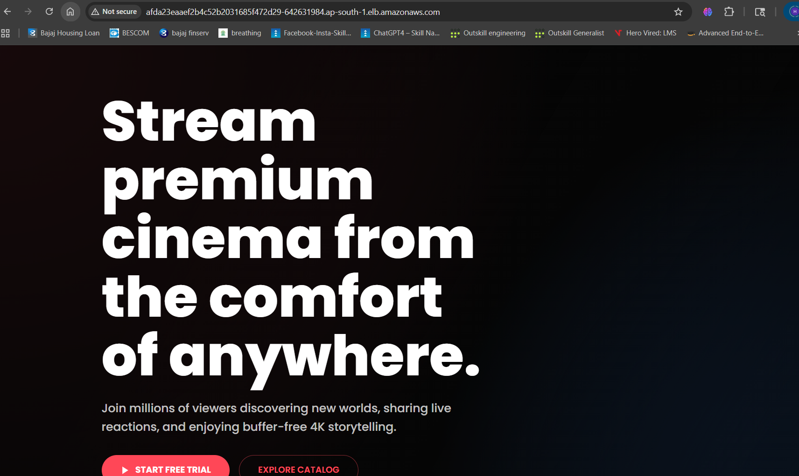


---

# 12. SNS Alerts Integration

## Create SNS Topic

SNS Topic Name:

```bash
streamingapp-alerts
```

## Create Email Subscription

Email subscription was added and confirmed successfully.

## Test SNS Notification

```bash
aws sns publish \
--topic-arn <SNS_TOPIC_ARN> \
--subject "Test Alert" \
--message "SNS integration working successfully"
```

## Jenkins Pipeline Integration

SNS notifications were integrated into Jenkins post-build actions.

## Jenkinsfile Post Actions

```groovy
post {

    success {

        sh '''
        aws sns publish \
        --topic-arn arn:aws:sns:ap-south-1:610405653088:streamingapp-alerts \
        --subject "Jenkins Pipeline Success" \
        --message "StreamingApp deployment completed successfully."
        '''

        echo 'Deployment Successful!'
    }

    failure {

        sh '''
        aws sns publish \
        --topic-arn arn:aws:sns:ap-south-1:610405653088:streamingapp-alerts \
        --subject "Jenkins Pipeline Failed" \
        --message "StreamingApp deployment failed. Check Jenkins logs."
        '''

        echo 'Pipeline Failed!'
    }
}
```

## Screenshots

SNS Topic:


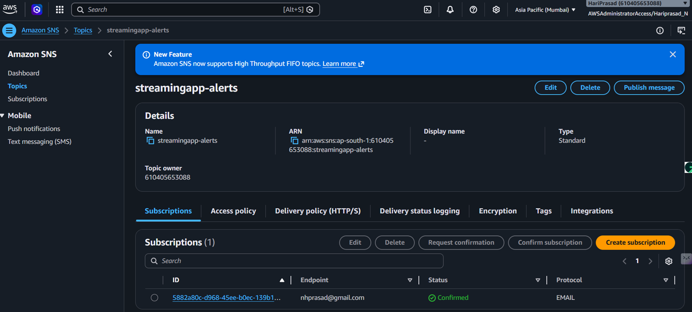


SNS Email Alert:


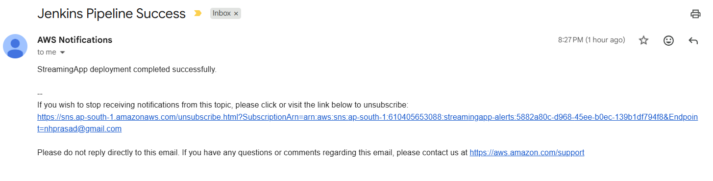


---

# 13. GitHub Webhook Automation

## Configure GitHub Webhook

GitHub webhook was configured to automatically trigger Jenkins pipeline.

## Webhook URL

```bash
http://<EC2-PUBLIC-IP>:8080/github-webhook/
```

## Workflow

```text
Code Push
→ GitHub Webhook
→ Jenkins Pipeline Trigger
→ Build and Deployment
```

## Screenshots

GitHub Webhook:


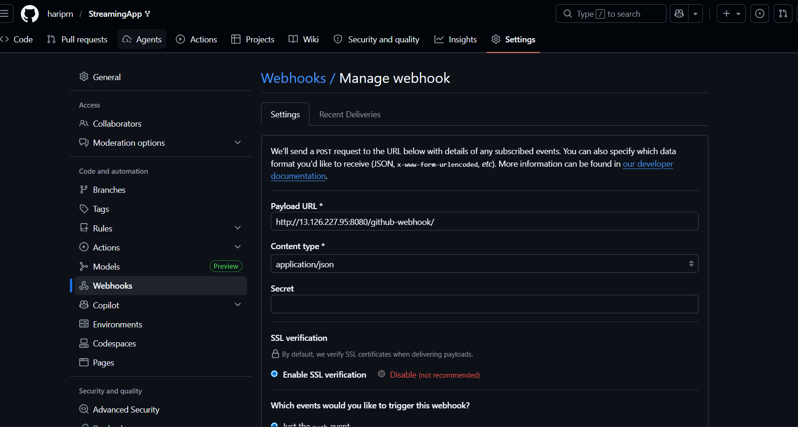


Jenkins Pipeline:


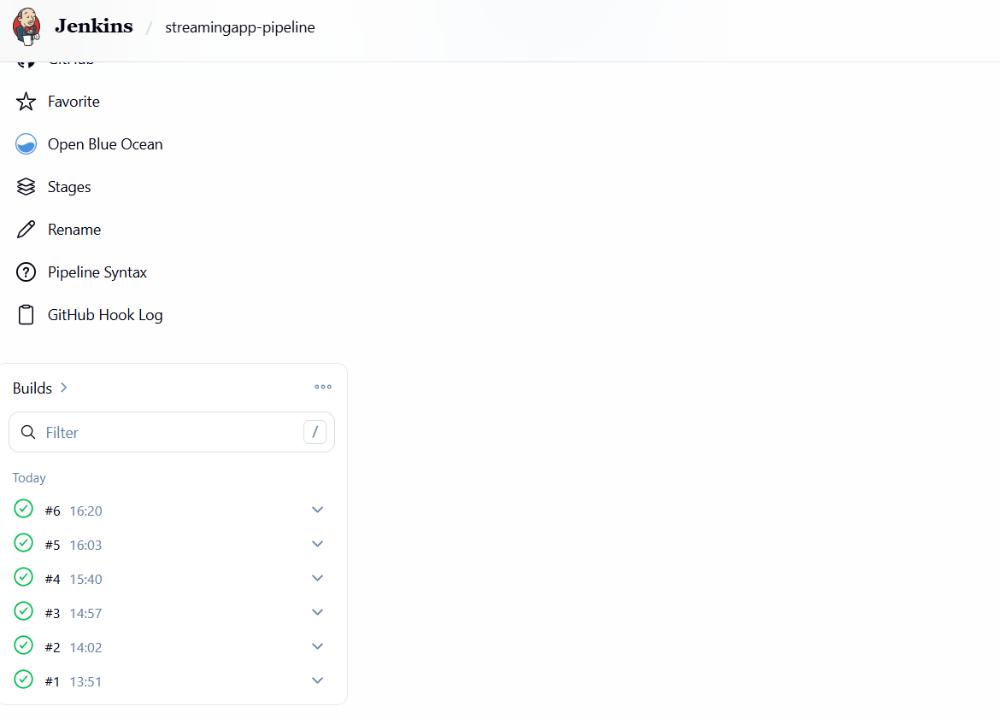


---

# 14. CI/CD Pipeline Workflow

The Jenkins pipeline performs the following operations:

1. Pull latest code from GitHub
2. Build Docker images
3. Push images to Amazon ECR
4. Deploy application using Helm
5. Verify Kubernetes rollout
6. Send SNS alerts

## Pipeline Stages

```groovy
Checkout
Build
Docker Login
Push Images
Helm Upgrade
Kubernetes Deployment
SNS Notifications
```

## Screenshots

Successful Pipeline:


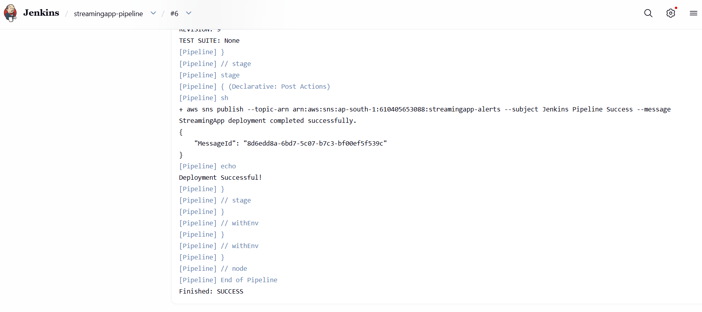


---

# 15. Application Validation

## Functional Validation

The following validations were successfully completed:

- Frontend accessible using LoadBalancer URL
- User registration successful
- User login successful
- MongoDB connectivity verified
- Kubernetes services accessible
- Auto deployment working
- Monitoring working
- SNS alerts working

## Validation Commands

```bash
kubectl get pods -n streamingapp
kubectl get svc -n streamingapp
kubectl get hpa -n streamingapp
kubectl top nodes
kubectl top pods -n streamingapp
```

---

# 16. Challenges Faced and Solutions

## Challenge 1: Jenkins Java Version Error

### Problem

Jenkins required Java 21 but Java 17 was installed.

### Solution

Installed Java 21:

```bash
sudo apt install openjdk-21-jdk -y
```

---

## Challenge 2: Jenkins Repository GPG Error

### Problem

APT repository signature verification failed.

### Solution

Added Jenkins repository key correctly.

---

## Challenge 3: Frontend API URL Issue

### Problem

Frontend attempted API calls to localhost instead of Kubernetes LoadBalancer.

### Solution

Updated frontend environment variables and rebuilt Docker images.

---

## Challenge 4: Helm Ownership Conflicts

### Problem

Existing Kubernetes resources conflicted with Helm-managed resources.

### Solution

Deleted old resources and redeployed using Helm.

---

## Challenge 5: Kubernetes Authentication Error for Jenkins User

### Problem

Jenkins user could not access Kubernetes cluster.

### Solution

Copied kubeconfig file to Jenkins user home directory.

Commands:

```bash
sudo mkdir -p /home/jenkins/.kube
sudo cp ~/.kube/config /home/jenkins/.kube/config
sudo chown -R jenkins:jenkins /home/jenkins/.kube
```

---

## Challenge 6: CloudWatch Metrics Not Visible

### Problem

Container Insights displayed zero metrics.

### Solution

Attached CloudWatch IAM policy to EKS node role.

---

## Challenge 7: SNS Email Confirmation Delay

### Problem

SNS email confirmation initially not received.

### Solution

Recreated subscription and confirmed email successfully.

---

# 17. Future Improvements

Possible future improvements:

- Terraform Infrastructure as Code
- ArgoCD GitOps Deployment
- Prometheus and Grafana Monitoring
- HTTPS using AWS ACM and Ingress
- Blue-Green Deployments
- Kubernetes Secrets Management
- Production MongoDB Cluster
- Redis Caching
- Service Mesh Integration

---

# 18. Conclusion

This project successfully implemented a complete production-style DevOps workflow for a MERN microservices application using AWS cloud services.

Major achievements:

- Containerized multi-service architecture
- Fully automated CI/CD pipeline
- Kubernetes deployment using Amazon EKS
- Helm-based application management
- Auto-scaling using HPA
- Monitoring using CloudWatch
- SNS alerting integration
- GitHub webhook automation

The project demonstrates strong practical understanding of cloud-native DevOps practices and production deployment workflows.


